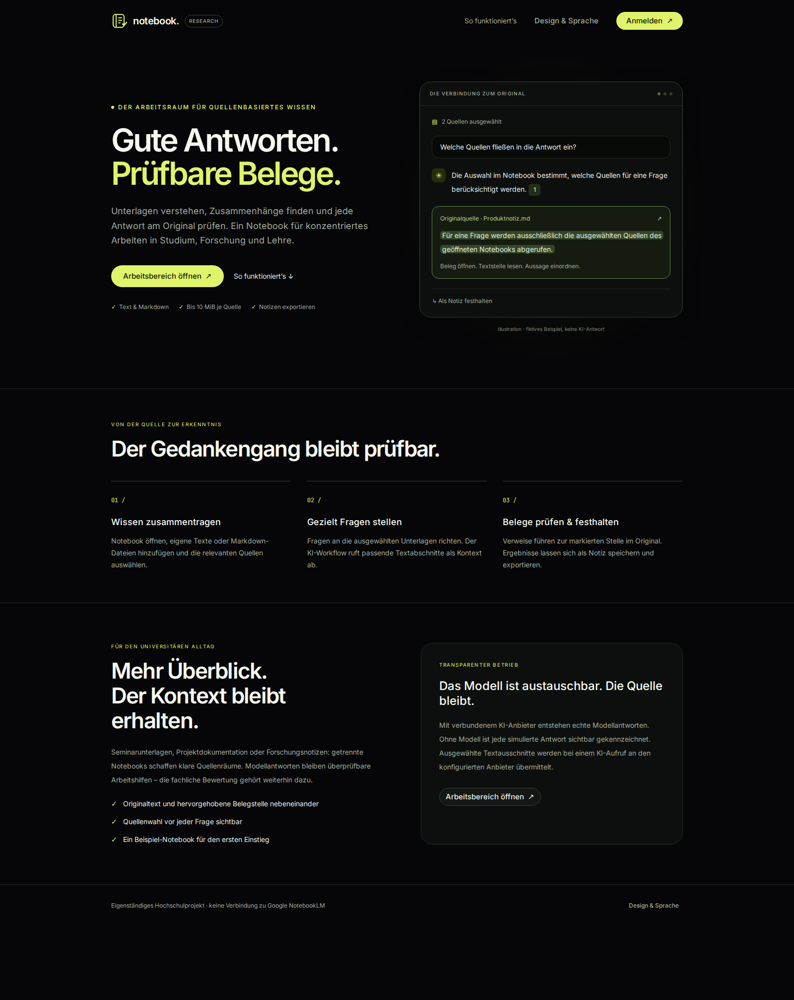
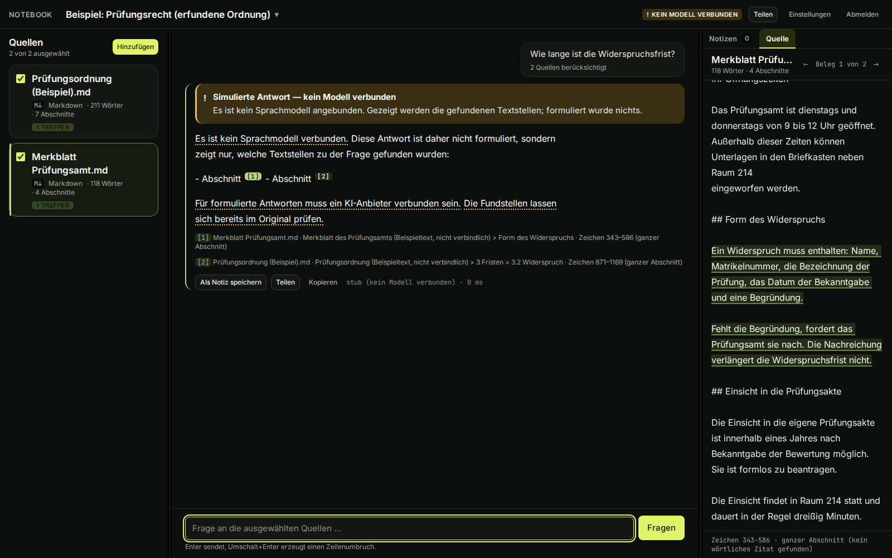
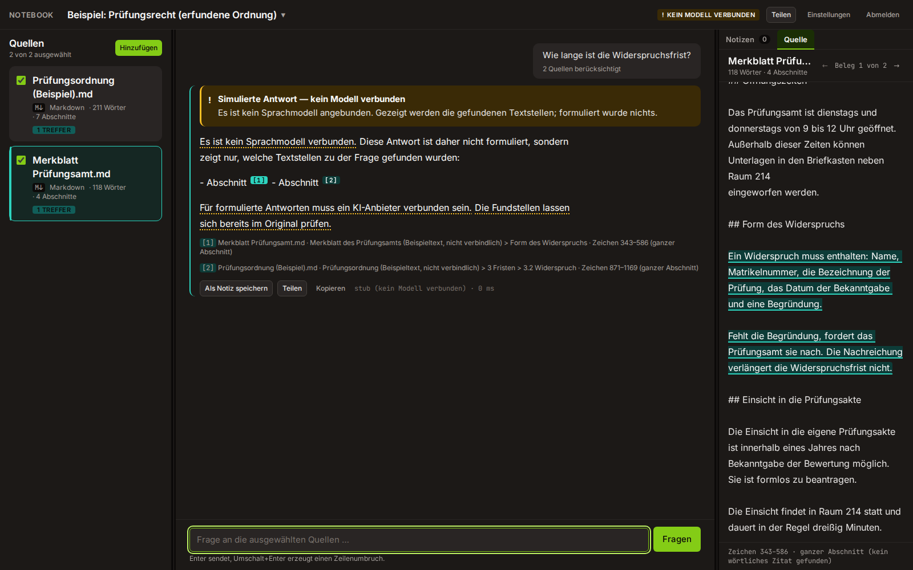

# Notebook

[](https://github.com/Huskynarr/Notebook/actions/workflows/ci.yml)
[](https://github.com/Huskynarr/Notebook/actions/workflows/codeql.yml)
[](LICENSE)

Ein eigenständiger NotebookLM-inspirierter Arbeitsbereich für die Universität:
**eigene Quellen auswählen, Fragen stellen, Belegstellen im Original prüfen und
Ergebnisse als Notiz speichern**. Keine Verbindung zu Google NotebookLM.

React, TypeScript strict und Tailwind CSS. Lokal/Plesk: Fastify und SQLite mit
FTS5/BM25. Für ChatGPT Sites: Worker, D1 für Suchindex/Notizen und R2 für
Originaltexte. Die öffentliche Sites-Version ist unter
`https://notebook.sebastianselinger.de` erreichbar.

## Oberfläche

Everlast ist das Standardtheme; Huskynarr, Papier und Tinte sowie Universität Freiburg
sind umschaltbar, jeweils hell/dunkel. Die Themes sind eigene Ableitungen, keine
behauptete offizielle Designfreigabe. Deutsch und Englisch sind verfügbar.







Die Screenshots vom 22.09.2026 zeigen den **gekennzeichneten Offline-Modus** mit
fiktiven Beispielquellen. Die Belegpositionen stammen aus diesen Originaltexten;
es wurde dafür keine echte Modellantwort erzeugt.
[Mobile Landingpage](docs/bilder/landing-mobile.png).

## Schnellstart auf localhost

Voraussetzung: Node **ab 22.18** und **pnpm 9.15.9**, Python 3 für den Theme-Check.

```bash
pnpm install
pnpm dev
```

Frontend: <http://localhost:5173> · API: <http://localhost:8787>

Die öffentliche Landingpage führt über **Anmelden** zum lokalen Demozugang
**Huskynarr / admin**. Die API legt beim ersten Start ein Beispiel-Notebook an und speichert
Notebooks, Quellen und Notizen in einer lokalen SQLite-Datei. Ohne Modellschlüssel
liefert sie ausschließlich sichtbar markierte Fundstellen, keine erfundene KI-Antwort.

Das neue Beispiel [„Everlast AI recherchieren“](docs/example-everlast.md) verbindet
die datierten Selbstauskünfte im Impressum und in der FAQ mit einer prüfbaren Frage
nach Gesellschaft und Vertretung. Für Geschäftsführung, Gesellschafter und Bilanzen
führt der Recherchepfad zu amtlichen Dokumenten, die Nutzende selbst hinzufügen;
ungeprüfte Finanzzahlen erscheinen nicht als Beispielbelege. Ein bestehendes
Prüfungs-Notebook auf Sites wird beim ersten Zugriff archiviert, seine Notizen
und Quellen bleiben erhalten. Bestehende lokale Daten werden nicht überschrieben.

Weitere feste Zugänge, beispielsweise `Everlast`, werden ausschließlich im Backend
über `AUTH_ADDITIONAL_USERS` in `apps/api/.env` konfiguriert (JSON-Liste mit
`username` und `password`, siehe `.env.example`). Das angeforderte Testpasswort ist
nur in der lokalen, von Git ausgeschlossenen Konfiguration hinterlegt und muss auf
einem anderen Rechner gesondert gesetzt werden. Im lokalen Fastify-Modus teilen
die Zugänge die Notebooks; auf Sites sind die Daten der Konten getrennt. Es gibt
weiterhin keine Registrierung oder Rollen.

`pnpm install` baut das gemeinsame Schema und installiert die Git-Hooks, sofern keine
fremden Hooks konfiguriert sind. Die API liest `apps/api/.env` automatisch. Der
Frontend-API-Ursprung wird über `VITE_API_BASE_URL` eingestellt; ein explizit leerer Wert
verwendet denselben Ursprung, ohne Angabe gilt lokal `http://localhost:8787`.

## Ein echtes Modell verbinden

```bash
cp apps/api/.env.example apps/api/.env
```

Für formulierte Antworten bleibt **`mimo-v2.6-flash-free`** die bevorzugte
Modell-ID. Das Backend erwartet dafür folgende Konfiguration:

```ini
LLM_PROVIDER=openai
LLM_BASE_URL=https://opencode.ai/inference/openai/v1
LLM_MODEL=mimo-v2.6-flash-free
LLM_API_KEY=
```

Auf Sites gehört der **OpenCode-Console-Inference-Key** als Secret
`LLM_API_KEY` in die Laufzeitumgebung. `LLM_ACCESS_STATUS=blocked` bleibt
gesetzt: Der authentifizierte Live-Test mit hinterlegtem Key und der öffentlichen
Everlast-Beispielquelle ergab am 24.09.2026 HTTP 403. Für eine Freigabe braucht es
eine echte Antwort samt gültigem Originalbeleg. Eine geänderte
Sites-Umgebung wird erst nach erneutem Deployment einer gespeicherten Version
wirksam. Schlüssel niemals in Chat, Git, Screenshots oder `VITE_`-Variablen
einfügen. Lokal steht der Schlüssel nur in der von Git ausgeschlossenen
`apps/api/.env`.

Diese Werte gehören in `apps/api/.env` oder die Sites-Umgebung, niemals ins
Frontend. Die [Console-Dokumentation](https://opencode.ai/v2/docs/console/inference/)
erlaubt schlüssellose Anfragen an kostenlose Chatmodelle. MiMo-V2.6-Flash Free ist in der
[Modellliste](https://opencode.ai/v2/docs/console/models/) derzeit nur **befristet**
kostenlos. Der tatsächliche externe POST am 23.09.2026 wurde jedoch mit
**HTTP 403 / FreeTierError** abgewiesen: OpenCode erlaubt diese kostenlose
Nutzung derzeit nur innerhalb von OpenCode. Der anschließende Sites-Test
lieferte für die Frage HTTP 503. Die gehostete Anwendung kennzeichnet die
externe MiMo-API deshalb als gesperrt und sendet keine weiteren Modellanfragen;
sie behauptet keine funktionierende Live-KI. Für einen echten KI-Betrieb wird
ein nachweislich erlaubter externer Anbieterzugang benötigt. Ein optionaler
Console-Service-Key kann ausschließlich serverseitig und für genau diese
Free-Modell-ID gesetzt werden; ob er die externe Sperre aufhebt, wird zuerst
mit einem [Test ohne vertrauliche Daten](docs/providers.md#console-service-key-prufen)
geprüft. Bis dahin bleibt die Site gesperrt.

Die gewünschte NVIDIA-Variante `nvidia/llama-nemotron-embed-vl-1b-v2:free`
von OpenRouter liefert Suchvektoren, **keine Chatantworten**. Für eine
optionale Neuordnung von FTS-Treffern auf dem Backend
`EMBEDDING_PROVIDER=openrouter` und einen **separaten OpenRouter-Key** als
serverseitiges Secret `OPENROUTER_EMBEDDING_KEY` setzen. Ein OpenCode-Key
funktioniert hier nicht. Ohne Aktivierung bleibt die lexikalische FTS5-Suche
erhalten. Der kostenlose Endpunkt protokolliert Eingaben: ausschließlich
öffentliche, unkritische Testdaten verwenden. Der erneute Live-Test am 24.09.2026
ergab **HTTP 401 von OpenRouter**: Die Authentifizierung mit dem hinterlegten
Embedding-Key wurde abgewiesen. Die Funktion bleibt auf der
veröffentlichten Site deaktiviert. Die OpenRouter-Suche hebt eine
Sperre des Antwortmodells nicht auf. Einzelheiten und Grenzen stehen in
[Indexierung](docs/indexing.md#optional-nvidia-suchvektoren-über-openrouter).

OpenCode Go führt `mimo-v2.6-flash` ohne `-free` mit Tokenpreisen; für die
gewünschte kostenlose V2.6-Variante ist bislang kein funktionierender externer
Aufruf mit gültigem Originalbeleg nachgewiesen. Ein Anbieterfehler schaltet
nicht heimlich auf ein anderes Modell um. Eingereichte Fragen
und Quellenausschnitte verlassen den Server und werden in den USA verarbeitet;
laut Anbieter können Daten des kostenlosen MiMo-V2.6-Flash-Free-Betriebs zur Modellverbesserung
genutzt werden. Vertrauliche Universitätsdaten benötigen vor Nutzung eine
ausdrückliche Freigabe. [Einrichtung, Grenzen und weitere Anbieter](docs/providers.md).

## Umfang und Belegprüfung

- Notebooks anlegen, öffnen, umbenennen und löschen.
- UTF-8-Text und Markdown einfügen oder importieren, maximal **10 MiB je Quelle**.
- Quellen gezielt auswählen; nur diese werden für die Frage abgerufen.
- Echte Modellantworten mit Markern, Originalzitaten und genauen Zeichenpositionen.
- Belege im Original hervorheben; Ergebnisse mit Belegauszügen als Notiz speichern,
  bearbeiten, löschen und als Markdown exportieren.
- Lokale Persistenz und sofort nutzbares Beispiel; keine Registrierung nötig.

Das Modell erhält nummerierte, als untrusted markierte Textabschnitte. Die API prüft
Marker, tatsächlich abgerufene Quellen, Zitate und Satzabdeckung. Ungültige echte
Modellantworten werden **vollständig zurückgehalten**. Ein wiedergefundenes Zitat
beweist keine inhaltliche Schlussfolgerung: Die fachliche Prüfung bleibt erforderlich.
Lexikalische Suche kann Synonyme und Fachformulierungen übersehen.

Beim Speichern einer Notiz werden Referenzen erneut gegen die Datenbank geprüft.
Wird die Quelle später gelöscht, bleibt der gespeicherte Auszug erhalten; das fehlende
Original wird in Oberfläche und Export kenntlich gemacht.

Text-PDFs sind optional und noch nicht implementiert. Registrierung, Rollen,
Zusammenarbeit, Audio/Video, Website-Import und Crawling sind keine Ziele dieser Version.
Die separat baubare Browserdemo (`VITE_DEMO=true`) ist **ungeschützt**, hat einen kleineren
Funktionsumfang und kein Modell. Sie ist kein Ersatz für den API-Betrieb.

## Schutz und Betrieb

Nach drei Fehlanmeldungen: 30 Sekunden Wartezeit, anschließend exponentiell bis
15 Minuten. Sperren gelten pro IP und Zugang; sie liegen lokal in SQLite, auf
Sites in D1. Der Client zeigt den Countdown auch nach Neuladen. Nur der Server
entscheidet über den Zugriff. Absichtliche Fehlanmeldungen können ein Konto
vorübergehend sperren; der Sites-Betrieb trennt die Daten der beiden Konten.

Produktionsbetrieb verlangt ein eigenes langes Passwort und Signaturgeheimnis.
Upload-, Speicher-, Export- und Anfragegrenzen begrenzen den Demo-Verbrauch. Forwarded-
Header werden nur von ausdrücklich konfigurierten Proxys akzeptiert. Modellschlüssel
bleiben im Backend; Sitzungstoken sind Zugangsdaten und liegen im Sitzungsspeicher.

- [ChatGPT Sites: D1/R2, Zugang, Veröffentlichung und Domain](docs/sites.md)
- [Alternativer Plesk-Betrieb: nginx, systemd und Backup](docs/deployment.md)
- [Fail2ban-Regeln mit positiven und negativen Prüffällen](docs/fail2ban.md)
- [Vollständiger Pflichtumfang und offene Annahmen](docs/product.md)

## Tests, Hooks und GitHub CI/CD

```bash
pnpm verify                         # Typen, Lint, Format, Build, Unit-/Integrations-/Tooltests
pnpm exec playwright install chromium
pnpm test:e2e                       # vollständiger Browserablauf
pnpm check:all                      # beide Prüfstufen
pnpm sites:build                    # Client + Sites-Worker bauen
node tools/check-sites-output.mjs   # Worker-Artefakt und Bindings prüfen
bash tools/test-fail2ban.sh          # benötigt installiertes fail2ban-regex
```

Pre-Commit prüft `pnpm verify`, Commit-Msg erzwingt Conventional Commits mit
`Verifiziert-durch:`, Pre-Push prüft `pnpm check:all`. GitHub CI prüft Pull Requests und
`main` zusätzlich mit Chromium, Sites-Build und Fail2ban. `release-please` leitet SemVer-Versionen
aus den Commit-Präfixen ab.

CI und CodeQL prüfen Code und Browserabläufe, aber keine Live-Verfügbarkeit
von OpenCode oder OpenRouter: Produktionsschlüssel werden nicht an PR-Runner
gegeben. Vor dem Entsperren eines Anbieters ist ein separater, begrenzter
Test mit der öffentlichen Everlast-Beispielquelle nötig. Die öffentliche
Landingpage nutzt [Such- und Social-Metadaten](docs/seo.md); der geschützte
Arbeitsbereich wird nicht als Suchergebnis ausgeliefert.

Sites nutzt ein eigenes Quellrepository; ein GitHub-Push allein veröffentlicht
keine neue Sites-Version. Die alternative Plesk-Pipeline baut erst nach erfolgreichen
Prüfungen ein geprüftes Release-Artefakt.
Deployment erfordert den manuellen Schalter und das Environment `plesk-production` mit
SSH-Zugang und geprüftem Hostschlüssel. Startfehler lösen einen Code-Rollback aus;
Datenbank-Backups bleiben gesondert erforderlich. Pages und Demo-Artefakte werden nur
manuell erstellt, keine automatische Veröffentlichung des lokalen Demozugangs.

Aktueller Prüfstand und ausdrücklich nicht ausgeführte Prüfungen:
[docs/progress.md](docs/progress.md).

## Mitwirken

[AGENTS.md](AGENTS.md) enthält die verbindlichen Arbeitsregeln.
[CONTRIBUTING.md](CONTRIBUTING.md) beschreibt die Mitarbeit;
[docs/architecture.md](docs/architecture.md) erklärt Modulgrenzen und Gründe,
[docs/indexing.md](docs/indexing.md) begründet Chunkgrößen, FTS5 und Belegpositionen;
[docs/seo.md](docs/seo.md) erklärt die öffentliche Linkvorschau und ihre Pflege;
[docs/design-system.md](docs/design-system.md) die Tokens und Komponenten,
[docs/decisions.md](docs/decisions.md) die Entscheidungen und
[AI_usage.md](AI_usage.md) den tatsächlichen KI-Einsatz.
Sicherheitsmeldungen: [SECURITY.md](SECURITY.md). Lizenz: [MIT](LICENSE).
