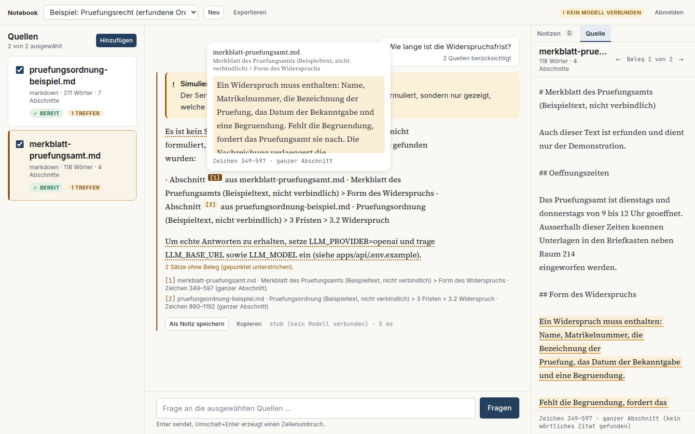
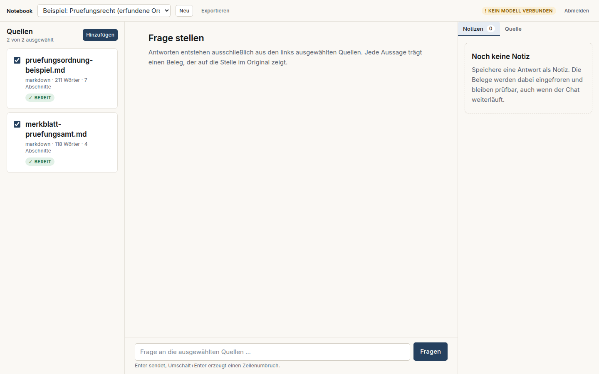
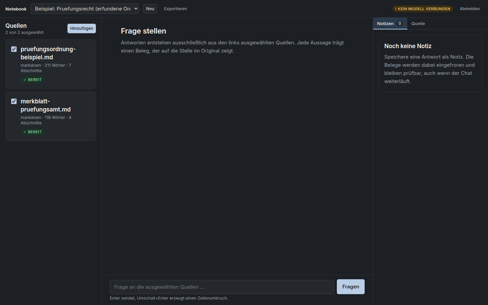
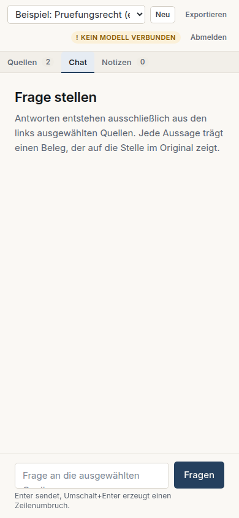

# Notebook

Ein quellenbasierter Arbeitsbereich für die Universität Freiburg. Fragen werden
ausschließlich aus selbst hinzugefügten Texten beantwortet, und **jede Aussage lässt sich in
einem Klick auf die Textstelle zurückführen, aus der sie stammt** — nicht auf das Dokument,
auf die Stelle.

Was das Projekt ist, für wen und mit welchen Grenzen: [`docs/product.md`](docs/product.md).
Verbindliche Arbeitsregeln: [`AGENTS.md`](AGENTS.md).

## So sieht es aus

Alle Aufnahmen entstanden am 2026-09-17 an der laufenden Anwendung, **im Offline-Modus ohne
verbundenes Sprachmodell** — daher die Plakette „kein Modell verbunden" oben rechts und der
Warnhinweis über der Antwort. Die Belegkette ist darin vollständig echt: die Marker zeigen
auf tatsächlich abgerufene Abschnitte. Nur der Antworttext ist nicht formuliert, sondern
eine Aufzählung der gefundenen Stellen.

### Ein Beleg wird geprüft

Klick auf `[1]` öffnet rechts die Quelle, springt zur Passage und hebt genau die belegenden
Zeichen hervor. Unter der Quelle stehen die Zeichenpositionen; die Quellenkarten links
zeigen, wie oft sie zur letzten Antwort beigetragen haben.



### Arbeitsbereich

Quellen links, Dialog in der Mitte, Notizen und Quellenansicht rechts.



### Dunkles Thema

Dieselben semantischen Tokens, für das dunkle Thema neu belegt — keine Komponente kennt
eine `dark:`-Variante.



### Schmaler Bildschirm

Unter 1280 px wird aus den drei Spalten eine, mit Tabs. Bei 390 px scrollt die Seite nicht
waagerecht — ein E2E-Test prüft das.



## Schnellstart

Voraussetzung: Node 22 oder neuer und pnpm 9. Sonst nichts — keine Datenbank, kein Docker.

```bash
pnpm install
pnpm --filter @notebook/shared build   # erzeugt die geteilten Typen
pnpm dev
```

Frontend: <http://localhost:5173> · Backend: <http://localhost:8787> · Zugang: `admin` / `admin`

Beim ersten Start legt das Backend ein Beispiel-Notebook mit zwei erfundenen Texten an.
Ohne verbundenes Modell läuft die Anwendung im **Offline-Modus**: sie formuliert keine
Antwort, sondern zeigt nur, welche Textstellen gefunden wurden, und kennzeichnet das
sichtbar. Das ist Absicht — eine plausibel klingende Ersatzantwort wäre eine unmarkierte
Simulation.

## Ein echtes Modell verbinden

Backend-Konfiguration nach `apps/api/.env` kopieren und anpassen:

```bash
cp apps/api/.env.example apps/api/.env
```

```ini
LLM_PROVIDER=openai
LLM_BASE_URL=http://localhost:11434/v1   # Ollama, vLLM, LiteLLM, Azure, OpenAI …
LLM_MODEL=qwen2.5:14b-instruct
LLM_API_KEY=                             # nur wenn der Endpunkt einen verlangt
```

Es genügt ein beliebiger Endpunkt, der die OpenAI-Chat-Completions-Schnittstelle spricht.
Zugangsdaten leben ausschließlich im Backend-Prozess; im Frontend ist genau eine Variable
konfigurierbar, `VITE_API_BASE_URL`.

## Aufbau

```
apps/web        Vite + React 19, TypeScript strict, Tailwind 4, eigenes Design
apps/api        Fastify, SQLite aus Nodes Standardbibliothek, FTS5/BM25
packages/shared zod-Schemata — der gemeinsame API-Vertrag
e2e             Playwright, prüft den Hauptablauf Ende zu Ende
docs            Produkt, Entscheidungen, Fortschritt, Design-System
```

## Wie ein Beleg entsteht

1. Beim Anlegen wird eine Quelle in Absatz-Abschnitte zerlegt. Jeder Abschnitt merkt sich
   seine **Zeichen-Offsets** im unveränderten Originaltext.
2. Zu einer Frage werden Abschnitte lexikalisch abgerufen (BM25) und dem Modell
   **nummeriert** vorgelegt. Deckt nichts die Frage, wird das Modell gar nicht erst gefragt.
3. Das Modell setzt Marker `[n]` und liefert zu jedem ein wörtliches Zitat.
4. Das Backend prüft **jeden** Marker gegen die tatsächlich abgerufenen Abschnitte. Was sich
   nicht auflösen lässt, wird aus der Antwort entfernt und in `droppedMarkers` gemeldet.
5. Das wörtliche Zitat wird im Abschnitt wiedergefunden — daraus entstehen die genauen
   Offsets. Gelingt das nicht, gilt der ganze Abschnitt, ausgewiesen als
   `precision: "chunk"`.
6. Ein Klick auf den Marker öffnet die Quelle und hebt genau diese Zeichen hervor.

## Befehle

| Befehl | Wirkung |
|---|---|
| `pnpm dev` | Frontend und Backend parallel |
| `pnpm verify` | Typen, Stil, Tests, Build — das, was die CI prüft |
| `pnpm test` | Unit- und Integrationstests (vitest) |
| `pnpm test:e2e` | Hauptablauf im Browser (Playwright) |
| `pnpm format` | Formatierung schreiben |

## Stand

Was tatsächlich funktioniert und was offen ist, steht in
[`docs/progress.md`](docs/progress.md) — nicht hier, damit es nicht veraltet.

Nicht-Ziele dieser Version: Nutzerkonten, Zusammenarbeit, Audio- und Videogenerierung,
Website-Crawling, umfangreiche Vektor-Infrastruktur. PDFs sind als spätere Erweiterung
vorgesehen.
