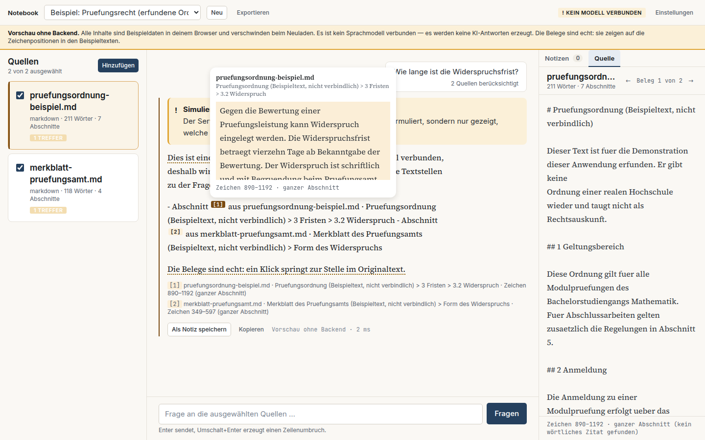
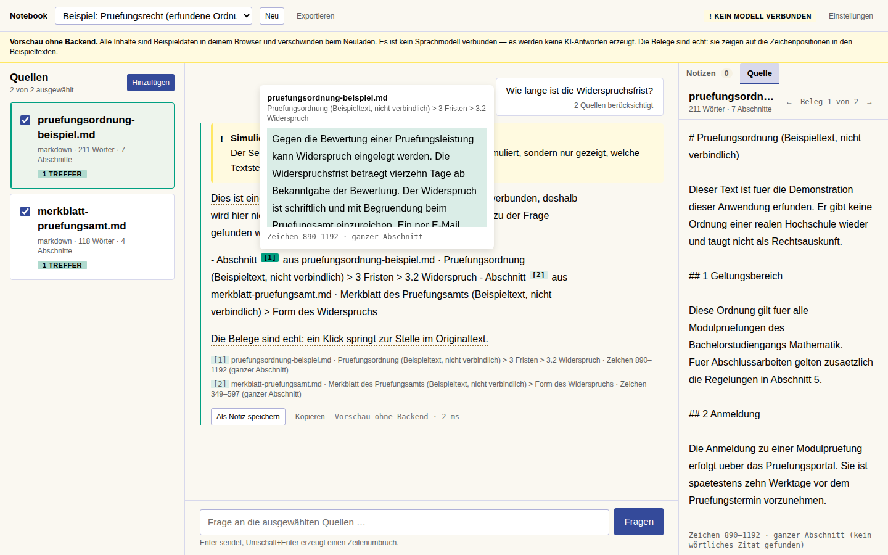
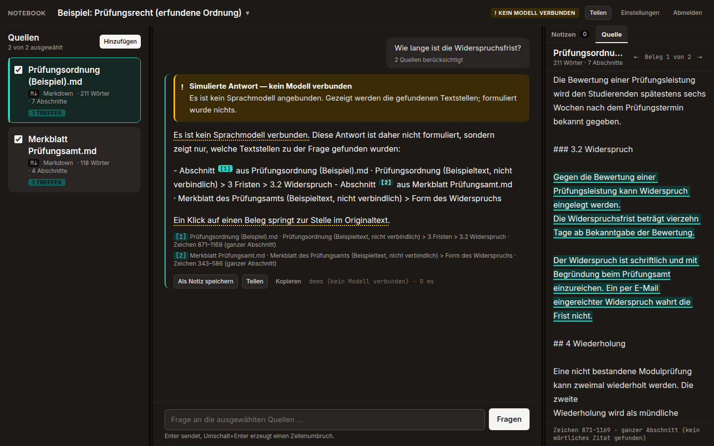
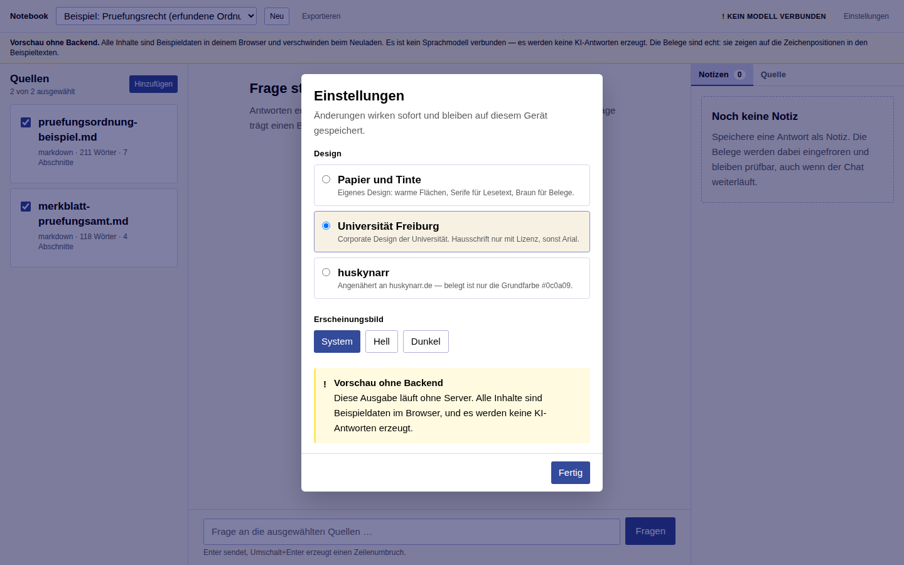
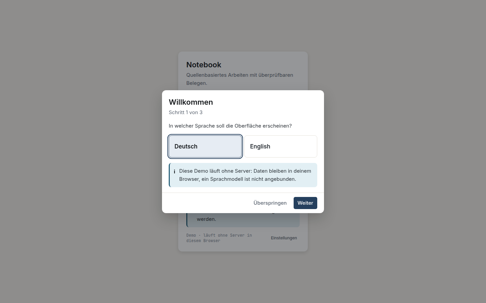

# Notebook

[](https://github.com/Huskynarr/Notebook/actions/workflows/ci.yml)
[](https://github.com/Huskynarr/Notebook/actions/workflows/codeql.yml)
[](https://huskynarr.is-a.dev/Notebook/)
[](LICENSE)
[](https://www.conventionalcommits.org/de/)

Ein quellenbasierter Arbeitsbereich für die Universität Freiburg. Fragen werden
ausschließlich aus selbst hinzugefügten Texten beantwortet, und **jede Aussage lässt sich in
einem Klick auf die Textstelle zurückführen, aus der sie stammt** — nicht auf das Dokument,
auf die Stelle.

Was das Projekt ist, für wen und mit welchen Grenzen: [`docs/product.md`](docs/product.md).
Verbindliche Arbeitsregeln: [`AGENTS.md`](AGENTS.md).

## So sieht es aus

Oberfläche auf **Deutsch und Englisch**; die Einführung beim ersten Start fragt Sprache und
Design ab. Quellen kommen als Text, Datei oder **Adresse** (Webseite, Text-/JSON-Endpunkt)
hinein; **Teilen** exportiert das Notebook oder eine einzelne Antwort als Markdown, Word,
PDF oder PNG. Die Spalten lassen sich am Trenner ziehen. Ein **Einwilligungsbanner** fragt
beim ersten Start, ob Einstellungen auf dem Gerät bleiben dürfen — Cookies oder Tracking
gibt es nicht, und eine Ablehnung wirkt.

Drei Designs, in den **Einstellungen** umschaltbar, je hell und dunkel. Die Komponenten
kennen kein Design — ein Design ist nur ein Satz von Farb-, Schrift- und Radius-Werten
(`tools/build-theme.py`). In jedem Design ist ein Zitat die einzige Stelle in der
Akzentfarbe: die gehört dem Beleg.

Alle Aufnahmen entstanden am 2026-09-18 ohne angebundenes Sprachmodell — daher die Plakette
„kein Modell verbunden". Die Belegkette ist darin echt: die Marker zeigen auf tatsächliche
Zeichenpositionen in den Texten. Nur der Antworttext ist nicht formuliert, sondern eine
Aufzählung der gefundenen Stellen.

### Live-Demo

**<https://huskynarr.is-a.dev/Notebook/>** — Zugang `admin` / `admin`.

Die Demo läuft vollständig im Browser: Notebooks, Quellen, Notizen und die Belegmechanik
sind echt und bleiben in deinem Browser gespeichert. Ein Sprachmodell ist nicht angebunden —
Antworten zeigen die gefundenen Belegstellen, formuliert wird nichts. Das ist dasselbe
Verhalten wie beim Server ohne Modell und an der Antwort gekennzeichnet.

### Papier und Tinte (Vorgabe)

Eigener Entwurf: warme Flächen, Serife für Lesetext, Braun für Belege.



### Universität Freiburg

Nach dem [Corporate Design](https://cd.uni-freiburg.de): Blau `#344A9A`, Sandtöne, Schwarz
für Text; CD-Grün ausschließlich für Belege. Die Hausschrift „Social" ist lizenzpflichtig
und nicht im Repository — zu sehen ist **Arial**, die vom CD vorgesehene Zweitschrift
(`apps/web/public/fonts/README.md`). Wo das Design über das CD hinausgeht, steht in
`docs/design-system.md`, Abschnitt 10.



### huskynarr

Angenähert an <https://huskynarr.de>. **Belegt ist nur die Grundfarbe `#0c0a09`**; Schriften
und Akzente der Vorlage sind nicht bekannt, der Rest ist Ableitung (`docs/design-system.md`,
Abschnitt 11).



### Einstellungen

Sprache, Design und Erscheinungsbild (System, Hell, Dunkel). Änderungen wirken sofort und
bleiben auf dem Gerät gespeichert.



### Einführung beim ersten Start



## Schnellstart

Voraussetzung: Node 22 oder neuer und pnpm 9. Sonst nichts — keine Datenbank, kein Docker.

```bash
pnpm install
pnpm dev
```

`pnpm install` baut das geteilte Paket `@notebook/shared` gleich mit (`prepare`); `test`,
`typecheck`, `lint` und `dev` bauen es vor dem Start erneut, damit ein `git pull` mit
Änderungen an den Schemata nicht zu veralteten Typen führt.

Frontend: <http://localhost:5173> · Backend: <http://localhost:8787> · Zugang: `admin` / `admin`

Beim ersten Start legt das Backend ein Beispiel-Notebook mit zwei erfundenen Texten an.
Ohne verbundenes Modell läuft die Anwendung im **Offline-Modus**: sie formuliert keine
Antwort, sondern zeigt nur, welche Textstellen gefunden wurden, und kennzeichnet das
sichtbar. Das ist Absicht — eine plausibel klingende Ersatzantwort wäre eine unmarkierte
Simulation.

## Ein echtes Modell verbinden

Backend-Konfiguration nach `apps/api/.env` kopieren und anpassen:

```bash
cp apps/api/.env.example apps/api/.env
```

```ini
LLM_PROVIDER=openai
LLM_BASE_URL=http://localhost:11434/v1   # Ollama, vLLM, LiteLLM, Azure, OpenAI …
LLM_MODEL=qwen2.5:14b-instruct
LLM_API_KEY=                             # nur wenn der Endpunkt einen verlangt
```

Es genügt ein beliebiger Endpunkt, der die OpenAI-Chat-Completions-Schnittstelle spricht.
Zugangsdaten leben ausschließlich im Backend-Prozess; im Frontend ist genau eine Variable
konfigurierbar, `VITE_API_BASE_URL`.

## Aufbau

```
apps/web        Vite + React 19, TypeScript strict, Tailwind 4, drei Designs
tools           build-theme.py - erzeugt theme.css aus den Paletten
apps/api        Fastify, SQLite aus Nodes Standardbibliothek, FTS5/BM25
packages/shared zod-Schemata — der gemeinsame API-Vertrag
e2e             Playwright, prüft den Hauptablauf Ende zu Ende
docs            Produkt, Entscheidungen, Fortschritt, Design-System
```

## Wie ein Beleg entsteht

1. Beim Anlegen wird eine Quelle in Absatz-Abschnitte zerlegt. Jeder Abschnitt merkt sich
   seine **Zeichen-Offsets** im unveränderten Originaltext.
2. Zu einer Frage werden Abschnitte lexikalisch abgerufen (BM25) und dem Modell
   **nummeriert** vorgelegt. Deckt nichts die Frage, wird das Modell gar nicht erst gefragt.
3. Das Modell setzt Marker `[n]` und liefert zu jedem ein wörtliches Zitat.
4. Das Backend prüft **jeden** Marker gegen die tatsächlich abgerufenen Abschnitte. Was sich
   nicht auflösen lässt, wird aus der Antwort entfernt und in `droppedMarkers` gemeldet.
5. Das wörtliche Zitat wird im Abschnitt wiedergefunden — daraus entstehen die genauen
   Offsets. Gelingt das nicht, gilt der ganze Abschnitt, ausgewiesen als
   `precision: "chunk"`.
6. Ein Klick auf den Marker öffnet die Quelle und hebt genau diese Zeichen hervor.

## Befehle

| Befehl | Wirkung |
|---|---|
| `pnpm dev` | Frontend und Backend parallel |
| `pnpm verify` | Typen, Stil, Tests, Build — das, was die CI prüft |
| `pnpm test` | Unit- und Integrationstests (vitest) |
| `pnpm test:e2e` | Hauptablauf im Browser (Playwright); baut Frontend und geteiltes Paket vorher |
| `pnpm format` | Formatierung schreiben |
| `pnpm theme` | `theme.css` aus den Paletten neu erzeugen |

## Mitwirken

Regeln, Einrichtung und Ablauf: [`CONTRIBUTING.md`](CONTRIBUTING.md). Verhaltenskodex:
[`CODE_OF_CONDUCT.md`](CODE_OF_CONDUCT.md). Sicherheitslücken bitte privat melden:
[`SECURITY.md`](SECURITY.md).

Die Pipeline prüft jeden Push und Pull Request (Typen, Stil, Formatierung, Tests, Build,
E2E im Browser, CodeQL), hängt an Pull Requests die Bundle-Größe und einen Demo-Build als
Artefakt, aktualisiert Abhängigkeiten wöchentlich (Dependabot) und erzeugt Releases aus den
Commit-Präfixen (release-please). `main` wird nach jedem Push als Demo auf GitHub Pages
veröffentlicht.

## Lizenz

[MIT](LICENSE) © 2026 Sebastian Selinger. Die Beispieltexte im Notebook sind erfunden und
keine Rechtsauskunft; die Hausschrift des Designs `uni-freiburg` ist nicht enthalten
(`apps/web/public/fonts/README.md`).

## Stand

Was tatsächlich funktioniert und was offen ist, steht in
[`docs/progress.md`](docs/progress.md) — nicht hier, damit es nicht veraltet.

Nicht-Ziele dieser Version: Nutzerkonten, Zusammenarbeit, Audio- und Videogenerierung,
Website-Crawling (eine einzelne Adresse als Quelle geht), umfangreiche
Vektor-Infrastruktur. PDFs sind als spätere Erweiterung vorgesehen.
